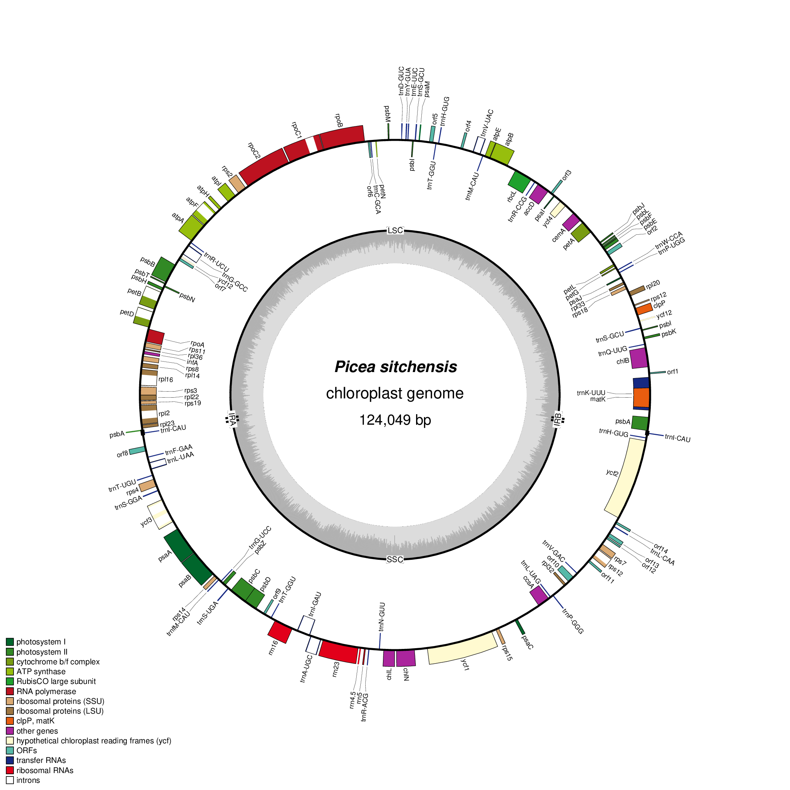

## Sitka Spruce Mitochondrial Genome Assembly

2018-07-03

| **Shaun Jackman**
| [\@sjackman][]
| [sjackman.ca](http://sjackman.ca)

[\@sjackman]: http://twitter.com/sjackman

## Shaun Jackman

| [Birol Bioinformatics Technology Lab](http://www.birollab.ca)
| [BC Cancer Genome Sciences Centre](http://bcgsc.ca) &middot; Vancouver, Canada
| [\@sjackman][] &middot; [github.com/sjackman](https://github.com/sjackman) &middot; [sjackman.ca](http://sjackman.ca)
| 

----------------------------------------

## Previous Work

+ Assembled and published the annotated sequences of \
  complete **white spruce plastid** genome \
  draft **white spruce mitochondrial** genome \
  (Jackman et al. 2015)
+ Assembled and published the annotated sequence of \
  complete **Sitka spruce plastid** genome \
  (Coombe et al. 2016)
+ Currently working to assemble and annotate the \
  draft **Sitka spruce mitochondrial** genome

## Sitka Spruce Plastid

+ One lane of Illumina 2x150 HiSeq of 10x GemCode
+ One library rather than two: \
  Illumina paired-end and mate-pair
+ Assemble with [ABySS][]
+ Scaffold with [ARCS][] and [LINKS][]
+ Close gaps with [Sealer][]
+ Polish with [Pilon][]
+ Annotate with [Maker][]
+ Manual annotation of difficult genes
+ Complete plastid genome in one contig
+ Perfect synteny to white spruce plastid

----------------------------------------

| {.plain height=600px}

## Sitka Spruce Mitochondrion

+ 10x Genomics Chromium sequencing
- &gt; 50x mitochondrial coverage in one lane
- 12 flowcells of Oxford Nanopore Sequencing
- 3x nuclear coverage
- 14x mitochondrial coverage

## Assembly Strategy

- Assemble the Nanopore reads
- Polish the assembly using Chromium reads
- Check for misassemblies using Chromium reads

## Nanopore reads

- Assemble Nanopore reads using [Miniasm][]
- Polish the assembly using [Racon][]
- Align reads to the draft assembly \
  and separate putative mitochondrial reads
- Assemble mtDNA Nanopore reads using [Canu][]

## 10x Genomics Chromium

- Assemble mtDNA Chromium reads using [Unicycler][] \
  guided by the Canu assembly
- Align Chromium reads to the assembly
- Check for misassemblies using [Tigmint][]

## Assembly

- 5.5 Mbp genome assembled in 5 contigs
- 3.54 Mbp, 881 kbp, 550 kbp, and 396 kbp
- One 168 kbp circular chromosome

----------------------------------------

{height=500px}

----------------------------------------

{height=500px}

----------------------------------------

{height=500px}

## Annotation

+ Annotate genes using [MAKER][] and [Prokka][]
- 97 ORFs similar to 45 mitochondrial genes \
  84 kbp or 1.5% of the genome
- 1,058 ORFS &geq; 300 bp \
  409 kbp or 7% of the genome
- 8 rRNA genes (3 distinct)
- 25 tRNA genes (17 distinct)
- 10 Type II introns in 9 genes

----------------------------------------

{.plain height=500px}

## Future Work

- Investigate genome structure \
  and possible genomic isomers
- Validate genome structure with PCR
- Quantify expression using Nanopore RNA-seq

## Shaun Jackman

| [Birol Bioinformatics Technology Lab](http://www.birollab.ca)
| [BC Cancer Genome Sciences Centre](http://bcgsc.ca) &middot; Vancouver, Canada
| [\@sjackman][] &middot; [github.com/sjackman](https://github.com/sjackman) &middot; [sjackman.ca](http://sjackman.ca)

**Slides** \
<https://sjackman.ca/psitchensismt-slides>

**Markdown source code** \
[https://github.com/sjackman/ \
psitchensismt-slides](https://github.com/sjackman/psitchensismt-slides)

[ABySS]: https://github.com/bcgsc/abyss
[ARCS]: https://github.com/bcgsc/arcs
[Canu]: https://github.com/marbl/canu
[LINKS]: https://github.com/warrenlr/LINKS
[MAKER]: http://www.yandell-lab.org/software/maker.html
[Miniasm]: https://github.com/lh3/miniasm
[Pilon]: http://www.broadinstitute.org/software/pilon/]
[Prokka]: http://www.vicbioinformatics.com/software.prokka.shtml
[Racon]: https://github.com/isovic/racon
[Sealer]: https://github.com/bcgsc/abyss/tree/master/Sealer
[Tigmint]: https://github.com/bcgsc/tigmint
[Unicycler]: https://github.com/rrwick/Unicycler

# Supplementary Slides

----------------------------------------

{height=500px}

## GC skew

| 
